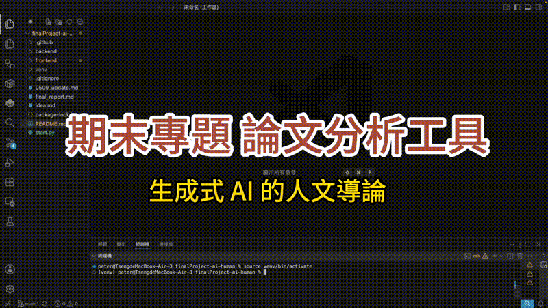

# 📄 論文分析工具

> **TAICA — 生成式AI的人文導論** 課程期末專案
> 指導老師：國立台灣大學 謝舒凱 教授

上傳學術論文 PDF，自動生成繁體中文**摘要、優點與缺點**。

使用本地端 LLM（Ollama + Qwen2.5），無需付費 API、資料不外傳。

---

## 功能

- 📤 支援拖曳或點擊上傳 PDF，一次最多 **5 個**（中英文論文皆可）
- 🗂 書架式側欄管理論文，即時顯示各篇分析進度
- 📊 即時**進度條**顯示分析狀態
- 🧠 自動生成：論文摘要、優點（Pros）、缺點（Cons）
- ⚖️ 支援**多篇論文比較分析**（摘要比較、優缺點表格、推薦總結）
- 💾 **記憶功能**：可開啟 localStorage 保存，重整後資料仍保留
- 📋 一鍵複製分析結果
- 🔄 支援單篇替換或全部替換論文檔案

---

## 介面預覽



---

## 技術架構

```
前端（React + Vite）
    ↓ HTTP / WebSocket
後端（FastAPI + Python）
    ↓
PDF 解析（PyMuPDF）→ 文字分段 → 逐段分析（Ollama）→ 生成總結
```

| 層級 | 技術 |
|------|------|
| 前端 | React 19、Vite、Axios |
| 後端 | FastAPI、Uvicorn |
| PDF 解析 | PyMuPDF |
| LLM | Ollama + Qwen2.5:7b（本地端） |
| 即時通訊 | WebSocket |

---

## 環境需求

- Python 3.9+
- Node.js 18+
- [Ollama](https://ollama.com) 已安裝並下載模型

---

## 安裝步驟

### 1. 下載模型

```bash
ollama pull qwen2.5:7b
```

### 2. 安裝後端套件

```bash
cd backend
python -m venv ../venv
source ../venv/bin/activate      # Windows: ..\venv\Scripts\activate
pip install -r requirements.txt
```

### 3. 安裝前端套件

```bash
cd frontend
npm install
```

---

## 啟動方式

### 一鍵啟動（推薦）

```bash
python3 start.py
```

腳本會自動檢查 Ollama 是否執行，並同時啟動 backend 與 frontend。按 **Ctrl+C** 可同時停止所有服務。

開啟瀏覽器：`http://localhost:5173`

### 手動啟動（分開執行）

**Terminal 1 — 後端：**

```bash
cd backend
source ../venv/bin/activate
uvicorn main:app --reload --host 0.0.0.0 --port 8000
```

**Terminal 2 — 前端：**

```bash
cd frontend
npm run dev
```

開啟瀏覽器：`http://localhost:5173`

---

## 使用說明

1. 將 PDF 拖曳到書架上傳區，或點擊「瀏覽檔案」選擇（最多 5 篇）
2. 點擊「分析待處理 N 篇」，多篇論文依序處理
3. 點擊書架中的論文卡片切換閱讀頁
4. 分析完成後可點擊右上角「複製」按鈕複製內容
5. 有 2 篇以上完成時，點擊「比較論文」進行跨篇比較

---

## 注意事項

- 請確認 Ollama 服務正在運行（`ollama serve`）
- 建議論文在 20 頁以內，過長會花較多時間
- 掃描版 PDF（無文字層）無法分析

---

## 團隊成員

| 姓名 | 學校 |
|------|------|
| 莊千響 | 銘傳大學 |
| 葉耀斌 | 銘傳大學 |
| 張照均 | 國立東華大學 |
| 曾建瑋 | 國立東華大學 |

---

🛠 開發規範 (Dev Notes)
為了保持開發效率與穩定，請遵循：

1. Push 規則：小型修正可直接 Push，大型功能建議開 feature/xxx 分支。
2. 同步習慣：Push 前請先 git pull --rebase，避免產生不必要的 Merge Commit。
3. 註釋要求：Commit message 盡量簡潔明瞭（例如：feat: 修正登入邏輯）。

`v2.1` · 2026-06-10 · 開發中
