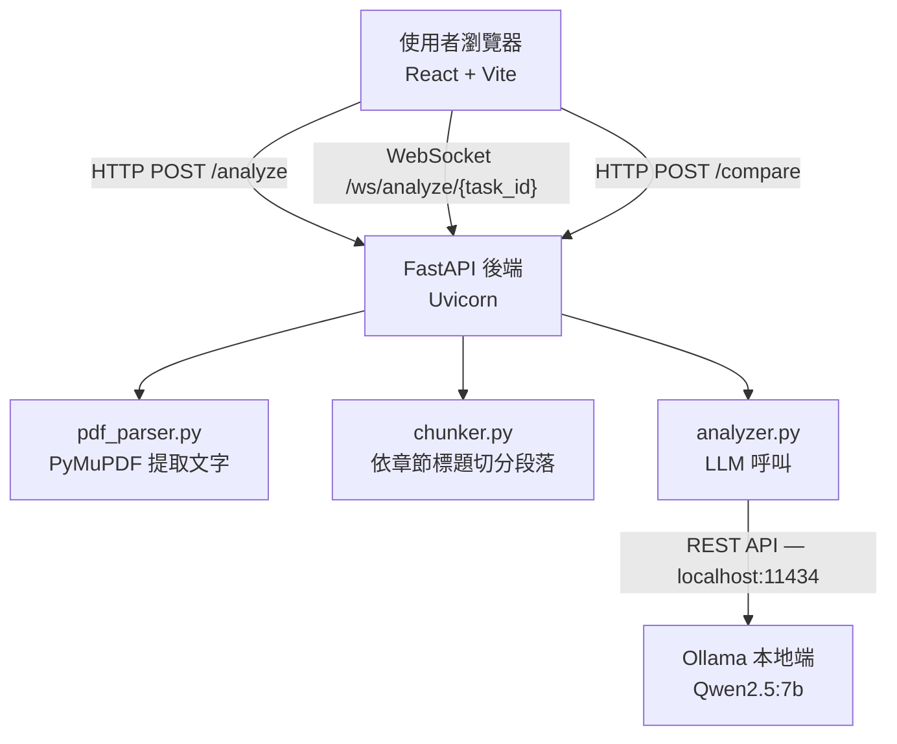
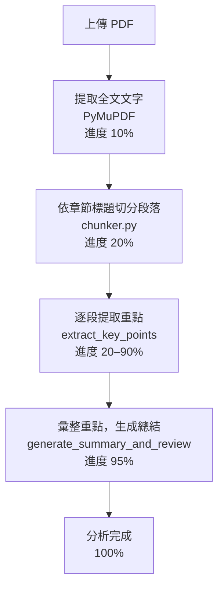
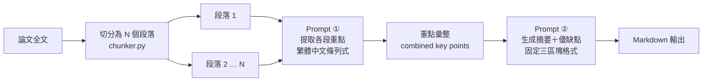

# 期末專案報告：論文分析工具

**課程**：TAICA — 生成式 AI 的人文導論  
**指導老師**：國立台灣大學 謝舒凱 教授  
**繳交日期**：2026 年 6 月

---

## 團隊成員

| 姓名 | 學校 |
|------|------|
| 莊千響 | 銘傳大學 |
| 葉耀斌 | 銘傳大學 |
| 張照均 | 國立東華大學 |
| 曾建瑋 | 國立東華大學 |

---

## 一、專案背景與動機

### 1.1 人文研究者的閱讀困境

文獻回顧是人文社會科學研究的基礎工作。無論是撰寫學術論文、準備研究計畫，或是追蹤某一議題的學術脈絡，研究者都必須大量閱讀、篩選、整理期刊論文。然而，這個過程面臨幾項實際困難：

**閱讀量龐大**：一個議題往往涉及數十乃至數百篇論文，光是判斷每篇論文是否與自己的研究方向相關，就需要耗費大量時間。

**語言障礙**：許多重要的學術成果以英文發表，對母語非英語的研究者而言，快速掌握一篇英文論文的核心論點與方法論本身就是一道門檻。

**比較困難**：面對研究主題相近的多篇論文，如何系統性地比較其方法論差異、優缺點，並做出閱讀優先順序的判斷，往往仰賴研究者累積多年的領域知識，對初學者而言尤其吃力。

### 1.2 專案目標

本專案旨在開發一套「論文分析工具」，讓使用者只需上傳 PDF 論文，系統即可自動：

1. 以繁體中文生成論文摘要
2. 條列論文的優點（Pros）與缺點（Cons）
3. 支援多篇論文同時比較分析

工具的定位是**輔助初步篩選**，而非取代深度閱讀。AI 生成的摘要與評析是幫助讀者決定「是否值得深讀」的第一道過濾，最終的學術判斷仍需由人來完成。

### 1.3 選擇本地端 LLM 的理由

本專案採用 Ollama + Qwen2.5:7b 在使用者本機執行推理，有意識地避免將論文內容送往第三方雲端 API。這個選擇出於以下考量：

- **學術資料隱私**：論文在正式發表前，或研究者正在研究的文獻方向，屬於敏感的學術資產。使用雲端 API 意味著資料可能被服務商留存、用於模型訓練，違背學術研究對資料保密的基本期待。
- **資料主權**：研究者有權決定自己的資料流向何處。本地端運算確保資料始終在使用者自己的設備上處理。
- **降低使用門檻**：無需申請 API 金鑰或支付費用，讓資源有限的學生或研究者也能使用。

---

## 二、AI 工具與人文研究的關係

### 2.1 輔助而非取代：工具的定位

課堂討論提醒我們，生成式 AI 的角色應是「協作者」而非「替代者」。在本工具的設計上，這個理念體現在以下幾個面向：

- AI 提供摘要與評析，但**不做最終判斷**。工具輸出的優缺點是模型對文本的詮釋，使用者必須結合自己的研究背景來判斷這些評析是否準確。
- 比較功能的「總結推薦」只是一個起點，研究者仍需自行決定閱讀順序與重點。
- 工具不儲存任何使用者的閱讀歷史或研究方向，刻意保留人類作為研究主體的自主性。

### 2.2 AI 摘要的認識論問題

使用 AI 輔助文獻閱讀，存在一個值得正視的認識論風險：**AI 的理解框架並非中立**。Qwen2.5 在訓練資料的選取、標注方式，乃至 RLHF 對齊過程中，都內建了特定的語言慣習與評價傾向。這意味著：

- 模型對「優點」與「缺點」的判斷，可能反映訓練語料的偏好，而非學術共識。
- 跨文化或非西方視角的論文，可能因訓練語料分布不均而被誤讀。
- 以英文寫作的論文經過模型「翻譯式」理解後，細微的論證層次可能被壓縮。

因此，本工具的輸出應被視為「閱讀前的粗略地圖」，而非「閱讀後的完整詮釋」。

---

## 三、系統架構

### 3.1 整體架構



### 3.2 技術選型

| 層級 | 技術 | 說明 |
|------|------|------|
| 前端 | React 19 + Vite | SPA 單頁應用，快速開發與熱更新 |
| HTTP 客戶端 | Axios | 處理檔案上傳與 API 呼叫 |
| 後端框架 | FastAPI + Uvicorn | Python 非同步 Web 框架 |
| 即時通訊 | WebSocket（wsproto） | 推送分析進度給前端 |
| PDF 解析 | PyMuPDF（fitz） | 高效提取 PDF 文字層 |
| LLM 推理 | Ollama + Qwen2.5:7b | 本地端大語言模型 |

---

## 四、功能設計

### 4.1 PDF 上傳

- 支援**拖曳**或**點擊**選擇 PDF 檔案
- 一次最多上傳 **5 個**論文
- 僅接受 `.pdf` 格式，上傳後立即在分頁列顯示

### 4.2 論文分析

分析流程分為四個階段，每個階段皆有對應的進度反映：

| 進度 | 步驟 | 說明 |
|------|------|------|
| 10% | 提取文字 | 使用 PyMuPDF 讀取 PDF 所有頁面的文字 |
| 20% | 文字分段 | 依學術章節標題切割為多個段落 |
| 20–90% | 逐段分析 | 每個段落透過 Qwen2.5 提取重點（繁體中文條列式） |
| 95–100% | 生成總結 | 彙整所有段落重點，生成摘要、優點、缺點 |



### 4.3 即時進度顯示

- 分析期間以**進度條**視覺化顯示百分比
- 同時顯示當前步驟文字說明（如「正在分析第 3/8 段...」）
- 多篇論文可自由切換分頁，各自顯示獨立進度

### 4.4 多篇論文比較

當有 2 篇以上完成分析時，可點擊「⚖️ 比較所有論文」，系統將輸出：

1. **摘要比較**：逐篇說明核心研究問題與貢獻，比較異同
2. **優缺點比較表**：以 Markdown 表格呈現各篇的研究方向、優點、缺點
3. **總結推薦**：推薦最值得深入閱讀的論文並說明理由

### 4.5 記憶功能

- 提供 ON/OFF 切換開關
- 開啟時，已完成分析的論文結果存入 `localStorage`
- 重整頁面後資料仍保留，無需重新分析

### 4.6 其他 UI 功能

- **一鍵複製**：點擊「複製」按鈕，將分析結果複製到剪貼簿
- **主題切換**：點擊背景可循環切換 4 種深色漸層主題配色
- **分頁管理**：每篇論文獨立一個分頁，可個別刪除，亦可「清除全部」

---

## 五、Prompt 設計

Prompt 設計是本專案的核心，直接決定 AI 輸出的結構與品質，也是課堂 Prompting 概念最直接的實踐場域。

### 5.1 分段重點提取 Prompt

```
以下是一篇學術論文的一個段落，可能是英文或中文。
請提取這段的重點，用繁體中文條列式回答，簡短精確：

{chunk}

重點：
```

**設計考量**：每次只送入一個段落，避免超過模型的有效 context 長度。限定「繁體中文、條列式、簡短精確」是為了降低後續彙整的難度，也確保輸出格式一致，便於最後組合。

### 5.2 總結生成 Prompt

```
以下是一篇學術論文各段落的重點整理：

{key_points}

請根據以上重點，用繁體中文輸出以下三個部分，格式如下：

## 論文摘要
（用3-5句話說明這篇論文在做什麼）

## 優點 Pros
- （條列3-5點）

## 缺點 Cons
- （條列3-5點）
```



**設計考量**：採用兩階段設計（先提取重點、再生成總結），而非直接把全文送入，是因為 Qwen2.5:7b 的有效 context 視窗有限。分段提取後再彙整，相當於讓模型在更精煉的資訊上進行最終判斷，輸出品質明顯優於直接輸入全文。強制指定三個輸出區塊（摘要、優點、缺點），是為了讓前端能穩定解析並渲染 Markdown。

### 5.3 多篇比較 Prompt

```
以下是多篇學術論文的分析結果：

{papers_text}

## 摘要比較
（逐篇說明各論文的核心研究問題與主要貢獻，並比較其異同）

## 優缺點比較表
| 論文 | 研究方向 | 主要優點 | 主要缺點 |
|------|---------|---------|---------|

## 總結推薦
（根據以上比較，推薦最值得深入閱讀的論文，並說明理由）
```

**設計考量**：比較 Prompt 直接在 Prompt 中提供表格的欄位結構，引導模型輸出可被前端渲染的 Markdown 表格，避免模型自由選擇格式導致前端解析失敗。

### 5.4 Prompt 設計的反思

在測試過程中，我們發現若不明確指定「繁體中文」，Qwen2.5 對英文輸入的回應有時會混入簡體字，顯示模型的語言切換需要顯性指令。此外，若不指定輸出長度（「3-5 句」「3-5 點」），模型的輸出長度差異極大，不利於使用者比較閱讀。這些發現與課堂討論的 Prompt engineering 原則——**明確、結構化、限制輸出格式**——高度吻合。

---

## 六、實作說明

### 6.1 後端：文字分段邏輯（chunker.py）

系統識別學術論文的常見章節標題（中英文皆支援），作為切割點：

```
Abstract、Introduction、Related Work、Methodology、
Experiment、Result、Discussion、Conclusion、Reference
摘要、引言、緒論、相關工作、文獻回顧、方法論、實驗、結果、討論、結論、參考文獻
```

若某段落超過 1500 個 token（以空格計算），則進一步切成子段落。這個設計直接對應課堂介紹的 Tokenization 概念：模型能有效處理的輸入長度有其上限，過長的輸入會使早期內容的注意力權重被稀釋，影響輸出品質。

### 6.2 後端：非同步任務管理（main.py）

1. `POST /analyze`：接收 PDF 後立即回傳 `task_id`，在背景啟動分析任務（`asyncio.create_task`）
2. `WebSocket /ws/analyze/{task_id}`：前端連線後，後端每 0.5 秒推送一次當前進度，直到分析完成後送出最終結果
3. 分析完成後清除任務記錄，並刪除伺服器上的臨時 PDF 檔案

### 6.3 前端：Markdown 渲染（App.jsx）

LLM 輸出為純文字 Markdown，前端自行實作 `formatText()` 函式進行轉換，支援標題、無序列表、粗體斜體、Markdown 表格，並對 HTML 特殊字元進行跳脫防止 XSS。

---

## 七、操作說明

### 7.1 環境需求

- Python 3.9+
- Node.js 18+
- [Ollama](https://ollama.com) 已安裝

### 7.2 安裝與啟動

```bash
# 1. 下載 LLM 模型
ollama pull qwen2.5:7b

# 2. 安裝後端套件
cd backend
python -m venv ../venv
source ../venv/bin/activate
pip install -r requirements.txt

# 3. 安裝前端套件
cd ../frontend && npm install

# Terminal 1 — 後端
uvicorn main:app --reload --host 0.0.0.0 --port 8000 --ws wsproto

# Terminal 2 — 前端
npm run dev
```

開啟瀏覽器：`http://localhost:5173`

### 7.3 使用流程

1. 將 PDF 論文拖曳至上傳區，或點擊選擇（最多 5 個）
2. 點擊「開始分析」，系統依序處理所有待分析論文
3. 分析過程中可切換分頁，查看各論文的即時進度
4. 分析完成後，點擊右上角「複製」按鈕可複製結果
5. 有 2 篇以上完成時，點擊「⚖️ 比較所有論文」進行跨論文比較

---

## 八、遇到的問題與限制

### 8.1 技術問題與解決方式

**WebSocket 連線時序競態條件**

前端在收到 `task_id` 後立即建立 WebSocket 連線，但此時後端的背景分析任務可能尚未寫入 `analysis_tasks` 字典，導致 WebSocket 端點找不到對應任務而直接關閉。解決方式：WebSocket 端點加入最多 30 秒的輪詢等待機制；前端在建立 WebSocket 前加入 1000ms 的延遲。

**Ollama 回傳格式不穩定**

Ollama 在模型載入延遲或記憶體不足時，可能回傳非預期格式，導致 `response.json()["response"]` 拋出 `KeyError`。解決方式：加入 `try/except` 捕捉例外，回傳帶有描述訊息的錯誤。

**Shell 編碼破壞 Regex**

在某些終端環境下透過 shell 傳遞程式碼時，`\r?\n` 等跳脫序列被錯誤解析，導致換行邏輯失效。解決方式：直接在原始碼中修正，不透過 shell heredoc 傳遞。

### 8.2 已知限制

| 限制 | 說明 |
|------|------|
| 掃描版 PDF | 無文字層的掃描 PDF（純圖片）無法提取文字，目前不支援 OCR |
| 長篇論文效能 | 論文超過 20 頁時，逐段分析耗時較長，約需 2–5 分鐘 |
| 本地端資源需求 | 需下載約 4.7 GB 的模型，對低規格設備不友好 |
| 循序處理 | 多篇論文目前採循序分析，無法平行處理 |
| 模型語言偏差 | 模型對英文論文的繁體中文輸出有時混入簡體字 |

---

## 九、倫理反思

### 9.1 AI 摘要與學術誠信

本工具在設計上預設了一個使用倫理：**AI 摘要是輔助篩選的工具，不是閱讀的替代品**。若使用者直接引用 AI 生成的分析而不閱讀原文，存在以下風險：

- AI 可能誤解論文的核心論點，尤其是方法論細節或理論前提
- 「優點」與「缺點」的評判是模型基於訓練資料的偏好，不代表學術社群的共識
- 引用 AI 摘要而非原文，在學術寫作規範上屬於不恰當的做法

我們建議將工具輸出作為「閱讀地圖」，幫助研究者決定哪些論文值得深讀，而非作為學術寫作的直接材料。

### 9.2 語言與文化偏差

Qwen2.5 的訓練語料以英文與簡體中文為主，這意味著：對於以繁體中文書寫的人文研究成果、台灣本土學術傳統，或非西方知識框架下的論文，模型的理解深度與評判標準可能不如英文主流學術更精確。這是目前所有大型語言模型共有的結構性問題，使用者應保持批判意識。

### 9.3 資料隱私的主動保護

選擇本地端 LLM 是一個主動的倫理立場，而非單純的技術偏好。研究者的論文閱讀清單本身就反映了其研究方向與學術關切，屬於應受保護的個人資料。本工具確保所有分析在使用者設備上完成，不留下任何外部資料足跡。

---

## 十、學習反思

這個專案讓我們在實作中重新理解了課堂上的幾個核心概念：

**Tokenization 的實際影響**：當我們發現直接把一篇 20 頁的論文丟給模型時，輸出品質明顯低落，才真正體會到 context 長度限制不只是技術規格，而是影響模型「理解」深度的根本因素。分段處理的決策，就是在用工程手段彌補模型的注意力限制。

**Prompt 設計是真正的核心工作**：我們花在 Prompt 調整上的時間，遠超過花在系統架構上的時間。同樣的模型，不同的 Prompt 結構可以產生截然不同的輸出品質。這讓我們深刻體會到課堂強調的「Prompt 是與模型溝通的語言」並非誇大其詞。

**AI 工具的謙遜**：做出這個工具之後，我們對它的輸出反而更謹慎了。親眼看到模型誤解論文、把次要方法論當成核心貢獻的案例，讓我們意識到 AI 對學術文本的「理解」與人類的詮釋之間，仍有難以量化的差距。這個距離，是設計 AI 輔助工具時必須誠實面對的。

---

## 結語

本專案以「讓研究者更輕鬆地進行初步文獻篩選」為出發點，在保護學術資料隱私的前提下，實現了自動化的論文摘要生成與多篇比較功能。

更重要的是，這個開發過程讓我們從使用者的角度，重新理解 AI 工具的角色定位：它應該讓人做出更好的判斷，而不是代替人做判斷。如何在工具的便利性與人類主體性之間取得平衡，是我們在這門課最深刻的學習。

---

## 附錄：組員分工說明

| 組員 | 負責工作 |
|------|---------|
| 葉耀斌 | 尋找並評估適合的本地端模型；實作英文論文摘要與優缺點生成；實作多篇論文輸入與整合比較功能 |
| 莊千響 | 開放支援中文論文輸入；實作拖曳上傳功能；加入載入旋轉動畫與進度條狀態動畫 |
| 曾建瑋 | 實作一鍵複製分析結果至剪貼簿；建立與管理 GitHub Repository |
| 張照均 | 修改網頁介面及主題 |
